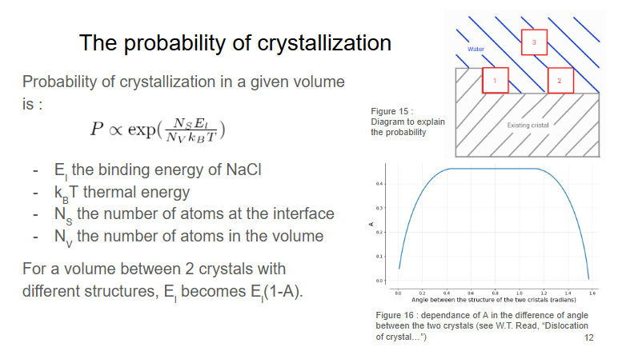

# FPT 2025, Salt Creeping
L'objectif de cette deuxième modélisation est de reproduire les observations microscopiques expérimentale sur le phénomène du salt creeping. On va reprendre l'idée d'une méthode type Monte-Carlo pour reproduire la cristallisation. Les hypothèses fortes créant une dépendanse dans l'algorithme précédent seront relachées. De plus des phénomènes de recombination des cristaux seront considérés.

## Quelques informations utiles

Pour compiler ce code, vérifier que la bibliothèque sfml est bien installée et utiliser les lignes de commandes suivantes : 
- g++ -Wall main.cpp Reseau.cpp Case.cpp Cristaux.cpp FonctionsUtiles.cpp -o sfml-app -lsfml-graphics -lsfml-window -lsfml-system  pour compiler.
- ./sfml-app pour éxecuter.

Avant de faire cela, penser à ajuster les les paramètres de la simulation. Les paramètres clés sont en haut du fichier main. Vous pouvez alors modifier la taille de la simulation avec nx et ny. Vous pouvez aussi choisir de voir la simulation en temps réel (attention, la simulation ne sera alors pas sauvegarder) ou extraire les données pour les traiter plus tard en python. 

Dans ce deuxième cas, vous pouvez jouer sur le nombre de pas de temps entre chaque état sauvegarder et choisir le nombre de situation à sauvegarder. 

## Le Modèle

### Les grandes étapes

- La première étape consiste à identifier tous les endroits où un cristal pourrait apparaître au prochain pas de temps. La condition utilisée est la présence d'eau à cet endroit à l'instant présent.
- Ensuite, nous devons estimer l'énergie en jeu et en déduire la probabilité de cristallisation. Cette probabilité est normalisée en fonction de la quantité de cristal disponible dans la solution due à l'évaporation.
- L'endroit où la cristallisation a effectivement lieu est ensuite choisi aléatoirement.
- Nous examinons ensuite les petits cristaux. Si un petit cristal est trop proche d’un autre selon l'équation de Kelvin, il est déplacé vers le grand cristal.
- Enfin, l'interface eau-air est réévaluée en fonction de la distance au cristal

### La loi de probabilité

La probabilité de cristallisation dépend du volume que l'on considère. Si ce volume est adossé à plus ou moins de bordures d'un même cristal, lors de la cristallisation hypothétique que l'on considère, la variation d'énergie va être différente. C'est ce qui est pris en compte dans la loi ci dessus. Si on a deux cristaux qui cotoient ce volume, la cristallisation ne pourra jamais être parfaite et une perte d'énergie lié au joint de grain sera nécessaire.

### Gestion des condition aux limites

Afin de gérer les bords de la simulation, le choix à été fait de prendre une case typique qui sera renvoyé dans le cas d'une sortie du tableau. 

Une autre possibilité serait de faire des conditions périodiques pour une direction et des cases typiques dans l'autre, reproduisant ainsi un tube.

## Organisation du code
Le code s'oganise sur 3 classes "amies". La première classe "case" permet de savoir les propriétés autour d'un point donner. Ces points sont regroupés dans un tableau qui fait partie de la deuxième classe, "reseau". Les cases sont aussi regroupé par ensemble simplement connectés de type >0 (présence de cristal) dans une classe "cristal".

Le gros du travail est effectué dans la classe reseau. Pour suivre le code, je conseille de partir de la méthode pas_de_temps et de dérouler le code depuis ce point. Si il y a des questions sur le code n'hésitez pas à me contacter par mail : baptiste.guilleminot@gmail.com . 